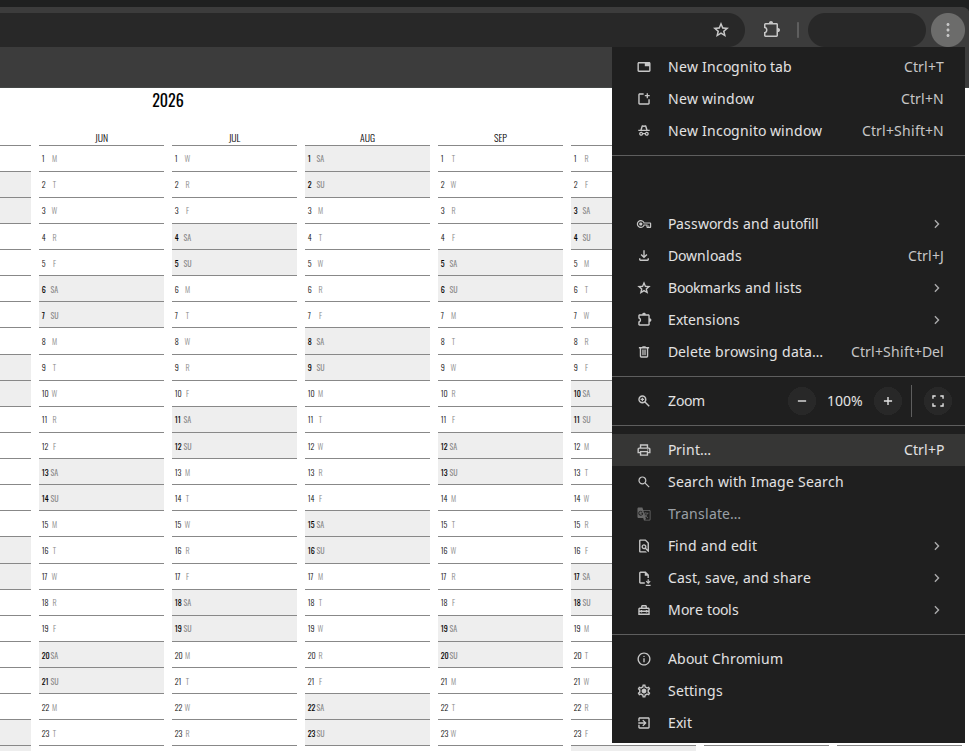
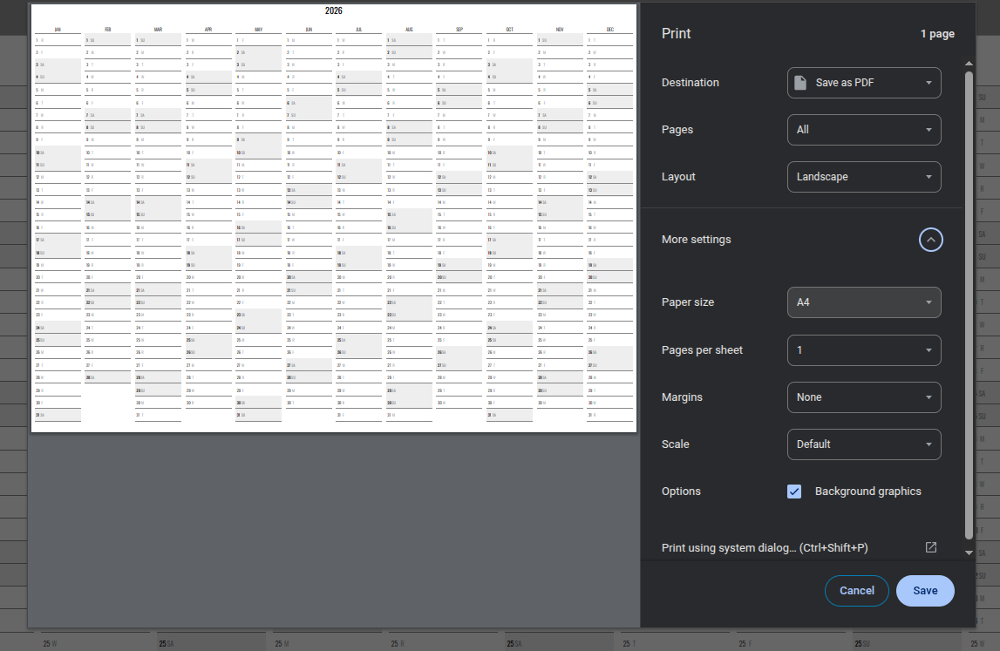
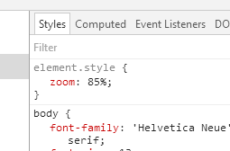

Printing Issues
---

This is a document dedicated to issues arising when trying
to print the [NeatoCal](https://github.com/abetusk/neatocal) single
page calendar.

* [How Do I Print](#how-do-i-print)
* [How Do I Print in Larger Sizes](#how-do-i-print-in-larger-sizes)
* [Printing Produces Multiple Pages](#printing-produces-multiple-pages)
* [The Issue Isn't Listed Here or Solutions Don't Work](#the-issue-isnt-listed-here-or-solutions-dont-work)

### How Do I Print?

Use the browser `Print` command.

Often this is the `Ctrl + P` or `(⌘) + P`
or can be accessed via a dropdown menu.

### How Do I Print in Larger Sizes?

Printing is a done through the browsers print driver, which means
it's independent of any parameters explicitly set by NeatoCal.

As such, paper size, orientation, and other options,
can be chosen from the print options menu when printing.

### Printing Produces Multiple Pages

This can happen when changing parameters that affect the calendar height,
such as changing the `cell_height` parameter.

The reasons it could spill onto multiple pages could be complicated
so there might not be an easy, catch-all fix.

Some strategies to try to fit it on a single page are:

* Try to adjust the `scale` parameter in the print settings
* Try to use another browser (Firefox, Safari) if the scale
  parameter isn't working in Chrome

If Chrome is absolutely necessary, there is a fix to set the CSS `zoom`
property globally by changing it manually from Chrome DevTools.
This can be done by:

* Press `F12` to launch Chrome DevTools
* Navigate to the **Elements** tab
* Select the `<body>` element
* Navigate to the **Styles** tab on the right
* In `element.style`, set the zoom level to something smaller (e.g. `85%`)

The above fix was taken from a [Stack Overflow SuperUser question](https://superuser.com/questions/979741/how-can-i-make-chrome-shrink-to-fit-on-printing).

### The Issue Isn't Listed Here or Solutions Don't Work

Please open an [issue](https://github.com/abetusk/neatocal/issues)!
